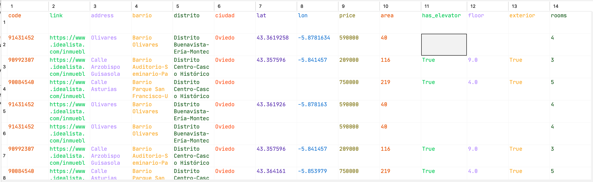
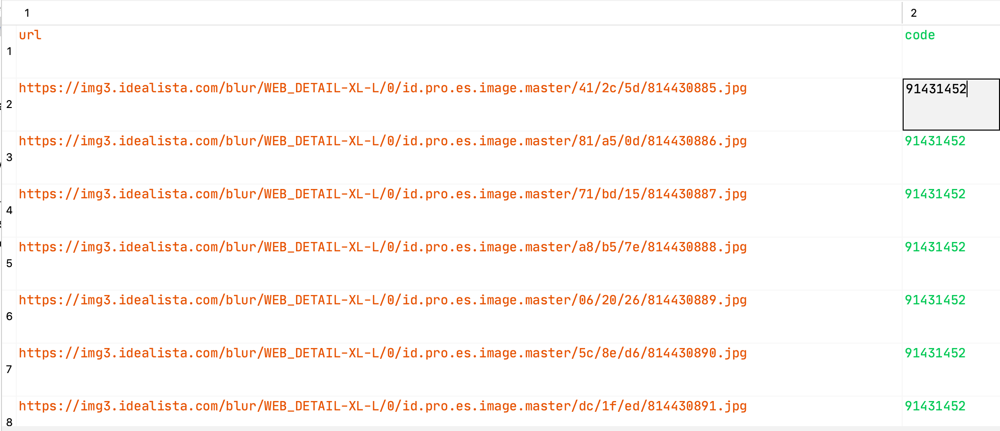

# idealistaScraper
Trabajo de la asignatura Tipología y ciclo de vida de los datos 

## Ejecución

Antes de ejecutar la aplicación es necesario descargarse el driver de selenium, para ello hay que ir a la dirección
https://github.com/mozilla/geckodriver/releases y descargar la última versión disponible para nuestro sistema operativo.


Como siguiente paso es necesario instalar las dependencias que tiene el programa, para ello
desde la linea de comandos se ejecuta:

````python
pip install -r requirements.txt
````
Para realizar el scaping usaremos la siguiente sentencia
````python
cd idealista
export PATH=$PATH:ruta_geckodriver
python idealistaScrapper.py venta viviendas --zona oviedo-asturias --full True
#descarga las imagenes
python images.py 20201028_venta-viviendas_oviedo-asturias.csv
````

## Contexto
Actualmente la compra-venta y alquiler de vivienda es un tema de actualidad, teniendo especial interés
los precios y la disponibilidad de vivienda en las diferentes zonas de la geografía Española.

Para ello se ha decidido recolectar información de las viviendas ofertadas en territorios específicos
para así poder estudiar cual es la evolución del precio y la cantidad de las ofertas a lo largo del tiempo.

Para conseguir este objetivo se ha decidido extraer la información del portal inmobiliario Idealista, dado
que Idealista es considerado como el portal de viviendas más importante y grande del país posiblemente se puede
extraer del mismo la información más completa y veraz acerca de como se encuentra el parque inmobiliario en un instante de tiempo específico.

##Definición título dataset
El titulo del dataset depende de la tipología y zona geográfica donde se realiza el proceso de scraping.
El formato seguirá la siguiente estructura:
- <tipo_transaccion>-<tipologia>_<ciudad>-<provincia>.csv
- <tipo_transaccion>-<tipologia>_<ciudad>-<provincia_images>.csv

Donde:
- **tipo_transaccion** puede ser venta o alquiler.
- **tipologia** Actualmente solo puede ser viviendas, pero se puede extender a cualquier tipologia existente en el portal de Idealista.
- **ciudad** Ciudad donde se realiza la búsqueda.
- **provincia**: Provincia a la que pertenece la ciudad.

Así si por ejemplo queremos buscar las viviendas en venta en la ciudad de Oviedo que pertenece a Asturias, los csvs generandos serán:
- **venta-viviendas_oviiedo-asturias.csv** Conteniendo los datos de cada inmueble.
- **venta-viviendas_oviiedo-asturias_images.csv** Conteniendo la ruta de las imágenes de cada inmueble.

##Descripción del dataset

A continuación se describen los dos datasets generados por el programa.

### Dataset viviendas
El dataset de viviendas es aquel que tiene los datos principales de cada uno de los anuncios publicados
en idealista. Tal como se ha comentado en el apartado anterior el nombre del mismo es "tipo_transaccion"-"tipologia"_"ciudad"-"provincia".csv
Por lo tanto podrán existir tantos CSVs como distintas búsquedas existan.

El formato del dataset es un csv, con cabecera y cuyos elementos se encuentran separados por comas ",".
Las columnas que contiene el dataset son las siguientes:

**code**: Código utilizado en idealista para identificar al inmueble. 

**link**: URL de la página de detalle del inmueble. 

**address**: Dirección donde se encuentra el inmueble. 

**barrio**: Barrio donde se encuentra el inmueble.

**distrito**: Distrito donde se encuentra el inmueble.

**ciudad**: Ciudad donde se encuentra el inmueble.

**lat**: Latitud donde se encuentra el inmueble.

**lon**: Longitud donde se encuentra el inmueble.

**price**: Precio al cual se oferta el inmueble en el portal.

**area**: Area del inmueble indicada en el portal.

**has_elevator**: Valor booleano indicando si el inmueble tiene ascensor.

**floor**: Valor numérico que indica el piso en el que se encuentra el inmueble.

**exterior**: Valor booleano indicando si el inmueble es exterior.

**rooms**: Indica el número de habitaciones que tiene el inmueble.

### Dataset imágenes
El dataset de imágenes contiene las URLs de las imagenes encontradas para cada uno de los 
inmuebles capturados. Una vez que se tiene este dataframe hay que ejecutar un nuevo scraper para descargar
las imágenes a un repositorio propio.

El formato del dataset es un CSV con cabecera y utilizando una coma "," para separar los atributos.

Los atributos que contiene el dataset son:

**url**: URL donde se encuentra la imagen a descargar.
**code**: Código del inmueble al que pertenece la imagen.

## Representación gráfica

### Dataset Viviendas


### Dataset Imagenes


